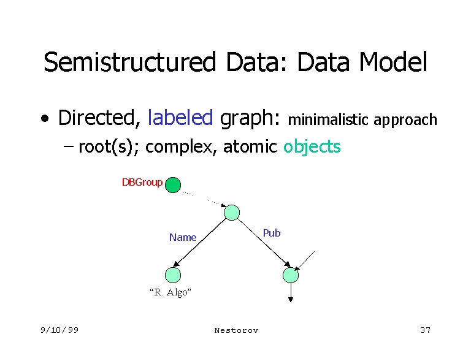
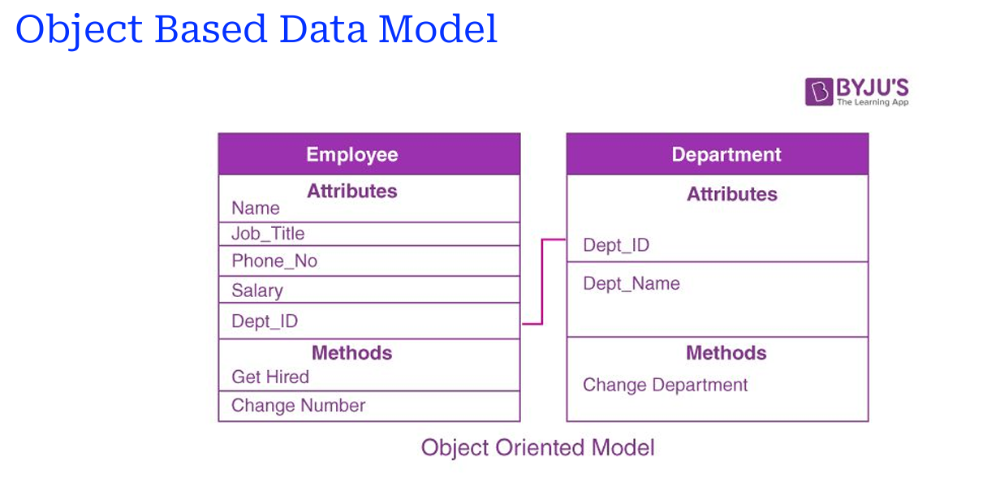
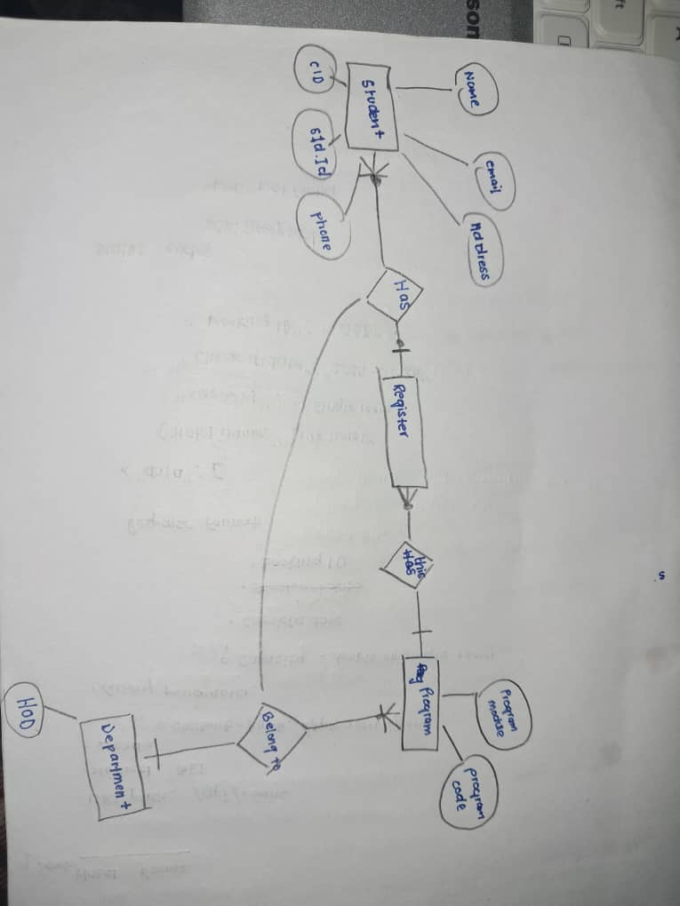

### Topic : Data users and data Administration

Data is information collected for future reference. Database systems assemble and store this information in a computer system, allowing users to access it when needed. Database systems are important for several reasons:

Securing and protecting important information from unauthorized access
Efficiently managing data to prevent chaos
Enabling multiple users to share and access data simultaneously

The general purposes of a Database Management System (DBMS) include:

Backup and Recovery
Data Independence
Data Integrity
Database Administration Tools
Data Storage, Retrieval, and Update

A data model refers to a set of tables, views, and other database objects grouped together to handle specific aspects of data. For example, when a customer orders from an e-shop, the data model would include customer details, purchased items, and delivery address.
Data models can be classified into 4 categories:

1.Entity-Relationship Model
Used for identifying entities and attributes to be represented in the database
Shows how different entities are related to each other

2.Semi-structured Data Model
Contains tags or markers to separate data elements
Examples include JSON and XML

3.Object-Based Data Models
Represent data in the form of objects
Follow object-oriented programming principles

4.Relational Model
The most widely used data model for databases
Organizes data into tables with rows and columns
()

Data Abstraction allows users to interact with the database without needing to understand complex details. 
It provides a simplified view of data through three levels:

1. Physical Level (storage and retrieval mechanisum)
2. Logical level (Data structure and relationship)
3. view level(users interaction)
()

specialization-an employee can be a tester or a developer

home work
Draw An entity relationship diagram for the studen registration system at CST

