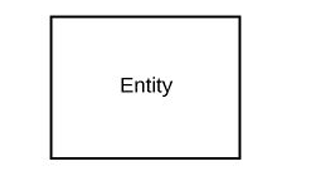
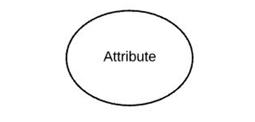
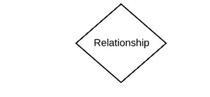
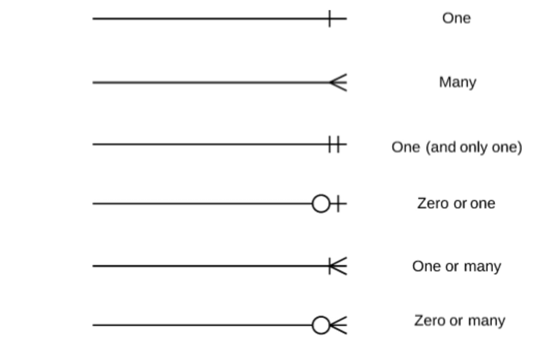

### Topic : Entity Relationship Model
1. Entity: “thing” or “object” in the real world., it is represented by a trangular shape.

2. Attributes: Attributes are descriptive properties, it is represented by oval shape.

3. Relationship: A relationship is an association among several entities, it is represented by dimond shape.

Prmiary Key is used as an identifying mechanism for whole entity set.
-Entity sets require unique identification of entities -Attributes must uniquely identify each entity
-No two entities can have identical value for all attributes

ERD: Types of attributes
1. Simple Attributes: Attributes are not divided into subparts.
2. Composite Attributes: Attributes can be 
divided into subparts
3. Single-valued Attributes: Attributes have 
single value for a particular entity.
4. Multi-valued Attributes: Attributes have more 
than one value for a particular entity
5. Derived Attributes:the value can be derived from other related attributes sucha as age can be derived from date of birth

Mapping cardinalities

1. One to one (1:1): A single entity in one entity set is associated with a single entity in another entity set. For example, one employee is assigned one company car.

2. One to many (1:N): A single entity in one entity set is associated with multiple entities in another entity set. For instance, one department has many employees.

3. Many to many (M:N): Entities in one entity set can be associated with multiple entities in another entity set. For example, students can enroll in many courses, and each course can have many students.

4. Many to one (N:1): Multiple entities in one entity set are associated with a single entity in another entity set. For example, many employees work in one department.

5. Ternary Relationships: A relationship type that involves three entity sets.

6. Unary Relationship (Recursive): A relationship between entities of the same entity set.

weak entities; A weak entity is an entity type that does not have its own primary key.

home work
Draw an entity relationship diagram for the student 
registration system at CST

Constraints on Specialisation/ Generalisation
1. Membership constraints
define the rules that specify how members of a superclass can or must participate in a subclass.

2. Disjoint constraints
define whether an entity can simultaneously belong to more than one subclass.

3. completeness constraints
determine whether every instance of a superclass must belong to at least one of its subclasses.

lesson 4
Relational Model it's based on organizing data into tables (or relations)
1. Structure: The definition of the database's relations 
and their contents. 
2. Integrity: Ensure the database's contents satisfy 
constraints. 
3. Manipulation: Programming interface for accessing and 
modifying a database's contents 

Relational Model Structure - it structures data in a way that is both intuitive and highly efficient.
1. Relation -  A Table
2. Tuple - Row of the table
3. Attribute - Column of the table.
4. Database schema - logical design
5. Database instance- snapshot of the database at a given instance of time

lesson 5
ERD to Relational Schema
involves translating the entities, relationships, and attributes represented in the ERD into a set of tables that can be implemented in a relational database.

Reducing E-R Diagrams to Relational Schemas

1.Create a Table for Each Entity Type
2.Handle Multivalued Attributes
3.Convert Composite Attributes
4.Ignore Derived Attributes
5.Convert Relationship Sets
