### Topic : Indexing
Indexes are special lookup tables (data structures in document databases) that a database search engine uses to speed up data retrieval or queries.

Types of indices
1. Ordered Indices: These store values in a sorted order and are useful for efficient searching. They can further be divided into:

      a. Clustering Index (Primary Index): The records in the file are stored in the same sorted order as the index entries, making retrieval of related records faster.

      b. Non-Clustering Index (Secondary Index): The records are not stored in the same order as index entries, meaning multiple records can have the same search key.

2. Hashed Indices: These distribute values uniformly across a range of buckets using a hash function. The bucket where a value is stored is determined by the hash function, which allows for quick data lookups.

3. Dense Index: An index entry exists for every search-key value in the file.

     a. In a dense clustering index, each index entry contains the search key and a pointer to the first record with that key.

    b. In a dense non-clustering index, each index entry stores a list of pointers to all records with the same search key.

4. Sparse Index: Unlike dense indices, sparse indices store index entries for only some search-key values. They can only be used if the relation is stored in sorted order.

5. Multilevel Index: When an index is too large to fit in memory, multilevel indexing creates an outer index that contains a subset of entries from the main index. This allows faster searches by first locating the correct range in the outer index and then looking into the main index.
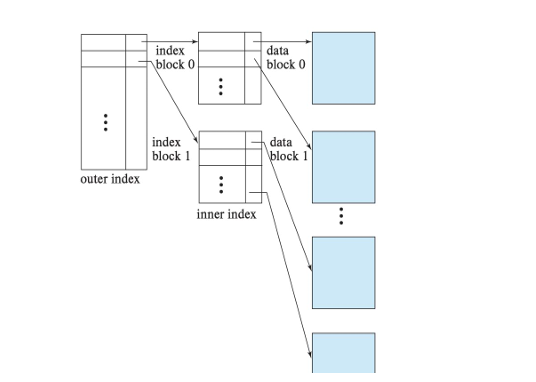

6. Secondary Index: Created on non-primary attributes to enable efficient searching on fields other than the primary key.

# BTREE
A B+ Tree is a self-balancing, ordered tree data structure that optimizes searches, sequential access, insertions, and deletions in O(log n) time. It is a generalization of a binary search tree, allowing nodes to have more than two children, making it highly efficient for handling large blocks of data.

Key Properties of B+ Trees Perfectly Balanced: 
1. Every leaf node is at the same depth, ensuring consistent search times.
2. Efficient Storage: Inner nodes store only keys, while leaf nodes store actual data values.
3. Fast Searching: The tree structure allows quick lookups by guiding searches through inner nodes before reaching the leaf nodes.
4. Optimized for Disk-Based Storage: Designed for systems that read and write large blocks of data efficiently.
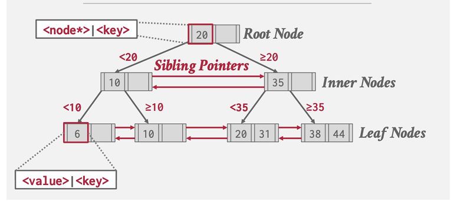

Why Use B+ Trees?
1. They provide fast access to indexed data, making them ideal for database indexing.
2. They reduce the number of disk accesses compared to traditional binary search trees.
3. They support range queries, making them useful for retrieving sorted data efficiently.
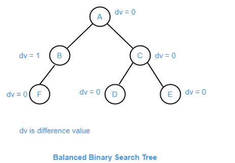

# Nodes
In the context of B+ Trees, nodes are fundamental building blocks that store key-value pairs in a structured manner. Each node plays a specific role in organizing and retrieving data efficiently.

Types of Nodes in a B+ Tree

1. Inner Nodes:
These nodes contain only keys and act as guides for searches.
They do not store actual data values but help navigate the tree structure.
Each inner node has multiple child pointers leading to other nodes.

2. Leaf Nodes:These nodes store actual data values.
They are linked together to allow efficient sequential access.
All leaf nodes exist at the same depth in the tree, ensuring balanced searches.

Key Properties of Nodes
1. Sorted Order: Keys within a node are maintained in sorted order for quick lookups.
2. Pointer-Based Navigation: Inner nodes contain pointers to child nodes, enabling efficient traversal.
3. Uniform Depth: Every leaf node is at the same depth, ensuring consistent search times.
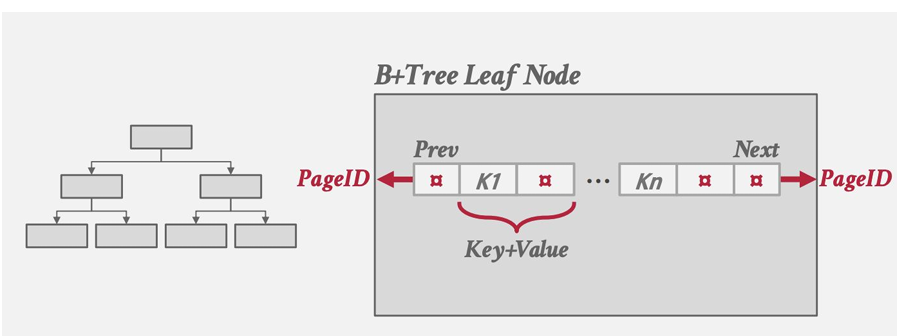
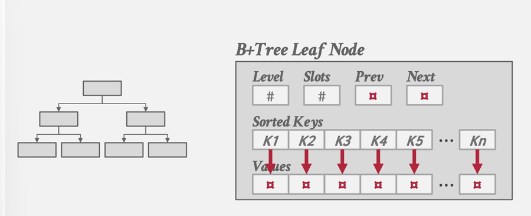

Difference Between B+ Tree and B-Tree

1. B-Tree: Stores keys and values in all nodes.
2. B+ Tree: Stores values only in leaf nodes, while inner nodes act as guides for searches.
 
# Searching/Quering in a B +Tree

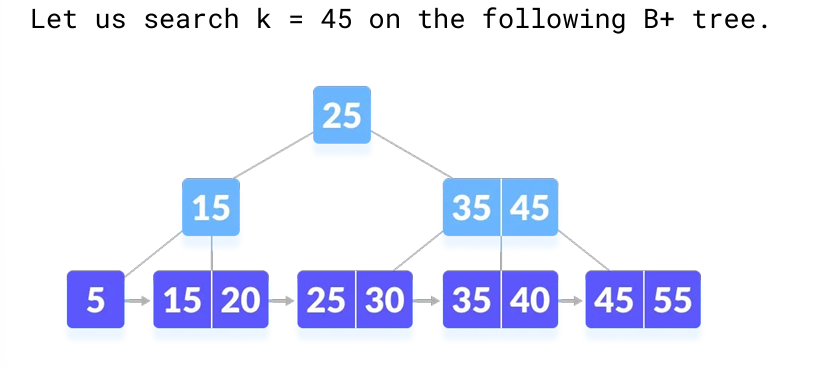
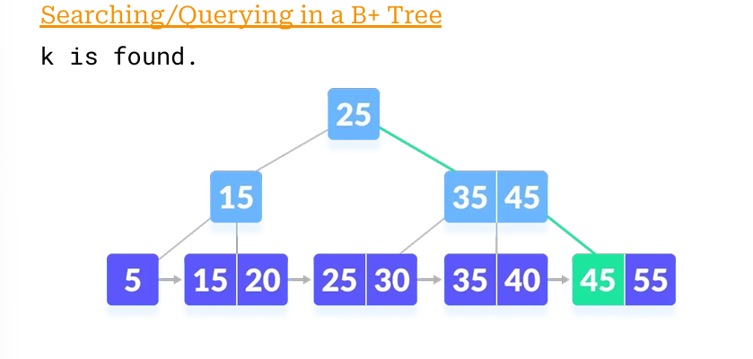

# Hash Indices

Hash indices are a technique used in databases to efficiently store and retrieve data using a hash function. Instead of searching through an entire dataset, hash indices allow quick lookups by mapping search keys to specific buckets.

# How Hashing Works

1. A hash function converts a search key into a bucket address.
2. When inserting a record, the system computes h(Ki) (where Ki is the key) to determine the bucket location.
3. If multiple keys hash to the same bucket, the system uses overflow chaining to store additional entries.

# Key Features

1. Fast Equality Lookups: Hash indices are optimized for queries like WHERE id = X, making them ideal for direct key-value searches.
2. Bucket-Based Storage: Data is stored in buckets, which can be in-memory (linked lists) or disk-based (blocks/pages).
3. No Range Queries: Unlike ordered indices, hash indices do not support range queries (BETWEEN X AND Y).

Static vs. Dynamic Hashing

Static Hashing: Uses a fixed number of buckets, requiring a rebuild if too many records are added.
Dynamic Hashing: Expands buckets incrementally, reducing the need for frequent reorganization.

Example usage

-- Create a table
CREATE TABLE users (id SERIAL PRIMARY KEY, name TEXT);

-- Create a hash index
CREATE INDEX ON users USING hash (id);

-- Insert data
INSERT INTO users (name) VALUES ('Alice'), ('Bob'), ('Charlie');

# Hash Index Operations
Hash index operations involve efficiently storing and retrieving data using a hash function. These operations allow databases to quickly locate records without scanning the entire dataset.

Key Operations

1. Equality Lookups:
The system computes h(Ki), where Ki is the search key.
The corresponding bucket is accessed directly, making retrieval fast.
Example SQL query:

SELECT * FROM users WHERE id = 2;
Insertions:

The system computes h(Ki) to determine the bucket location.
The new record is added to the bucket.
If multiple records hash to the same bucket, overflow chaining is used.

2. Deletions:

The system computes h(Ki) to locate the bucket.
The record is removed from the bucket’s linked list.
Example SQL query:
DELETE FROM users WHERE id = 2;

# Disk-Based Hash Indices

Disk-based hash indices are a type of database indexing technique where records are stored in buckets on disk rather than in memory. This method is particularly useful for handling large datasets efficiently.

How It Works

1. A hash function maps search keys to specific bucket addresses.
2. When inserting a record, the system computes h(Ki) (where Ki is the key) to determine the bucket location.
3. If multiple records hash to the same bucket, overflow buckets are used to store excess entries.

Choosing Number of Buckets

Number of buckets = (nr/fr) * (1 + d).
where 

nr = number of records.

fr = records per bucket.

 d = fudge factor (~0.2).

 This reduces probability of overflow, but overflow can 
still occur.
 A centre of excellence in science and technology

 

# lesson 15 Query processing

 Query Processing; 

Query processing refers to the set of activities involved in retrieving data from a database efficiently. It ensures that queries written in high-level languages like SQL are translated, optimized, and executed in a way that minimizes resource consumption while delivering accurate results.

Steps Involved in Query Processing
1. Parsing and Translation:

Queries written in SQL are converted into an internal form that the database can understand.

This internal representation is typically based on relational algebra.

The query is transformed into a query evaluation plan, specifying how the database should execute it.

2. Evaluation:

The database system considers multiple ways to execute the query.

Different execution plans have varying costs in terms of CPU usage and disk I/O operations.

The query execution engine runs the chosen plan and retrieves the required data.

3. Optimization:

The query optimizer selects the most efficient execution plan.

It estimates costs based on statistical information about the data and available indices.

The goal is to minimize resource consumption while ensuring fast query execution.
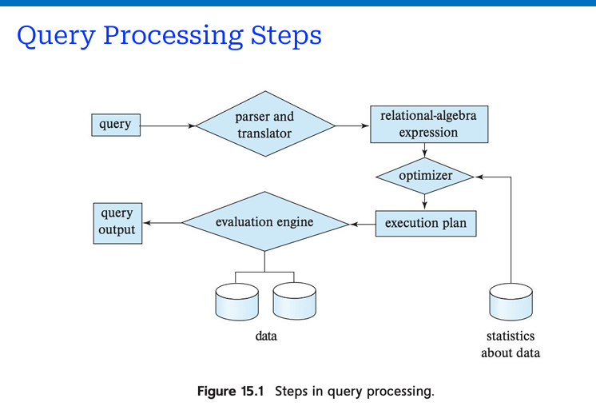

Query Processing steps
π_salary
   |
σ_salary < 75000; use index 1
   |
instructor

Query Evaluation 
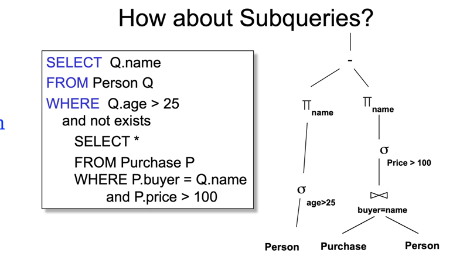

# Query Optimization

Query optimization is the process of finding the most efficient way to execute a database query. Since a query can have multiple execution plans, the goal of optimization is to minimize resource consumption while ensuring fast query execution.

Key Aspects of Query Optimization
1. Logical Query Plan:

Represents the query using extended relational algebra.

Focuses on the logical structure without specifying execution details.
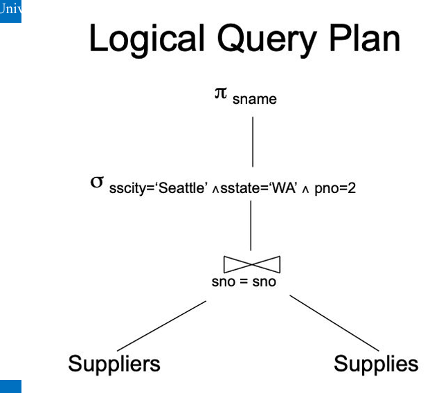

2. Physical Query Plan:

Adds annotations to the logical query plan.

Specifies access methods (e.g., file scans, index usage).

Determines the implementation for relational operators.
Physical Query Plan
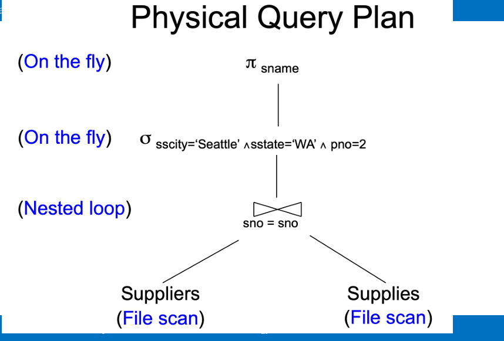

3. Query Cost Estimation:

Evaluates different execution plans based on factors like CPU usage and disk I/O operations.

The optimizer selects the plan with the lowest cost.
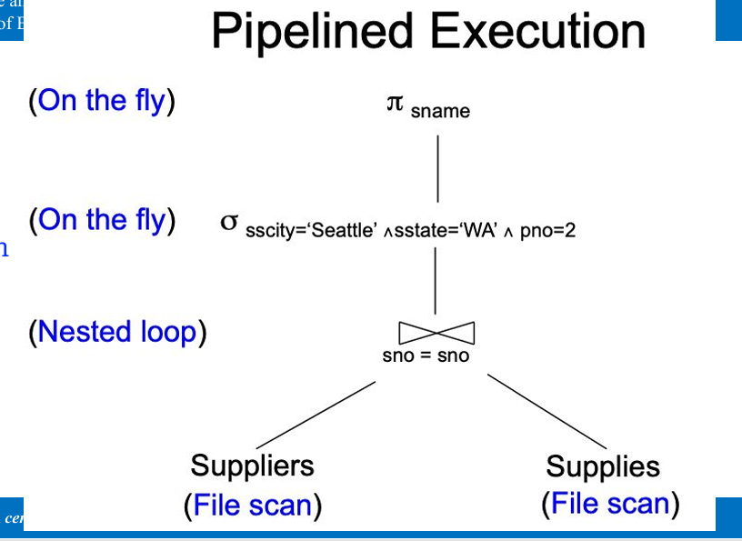

4. Optimization Techniques:

Indexing: Uses indexes to speed up data retrieval.
Pipelining Execution: Allows operations to execute sequentially without storing intermediate results.
Materialization: Stores intermediate results in temporary relations when necessary.

Response Time vs. Resource Consumption:

A query plan with higher resource consumption may have better response time if disk accesses are parallelized.
Optimizers generally aim to minimize total resource consumption rather than response time.

Measures of Query Cost;
Query cost refers to the resources required to execute a query efficiently. Since a query can have multiple execution plans, measuring its cost helps in selecting the most optimal plan.

Key Factors Affecting Query Cost

1. Disk I/O Cost:
The number of blocks transferred (b).
The number of random I/O accesses (S).
Average block transfer time (tT).
Average block access time (tS), which includes disk seek time and rotational latency.
Cost = b * tT + S * tS

2. CPU Cost:

Earlier, query cost was primarily calculated based on I/O access when databases were stored on magnetic disks.
With modern SSDs and main memory, I/O costs have reduced, making CPU costs more significant.
However, CPU costs are complex to calculate and are often estimated using simple models.

3. Response Time vs. Resource Consumption:

A query plan with higher resource consumption (e.g., extra disk reads) may have better response time if accesses are parallelized across multiple disks.
However, concurrent execution of such plans may lead to higher overall response time due to increased disk load.
Instead of minimizing response time, query optimizers generally aim to minimize total resource consumption.

4. urther Considerations:

Block writes are typically twice as costly as reads on magnetic disks.
SSD write throughput is about 50% of read throughput.
Buffer memory availability affects query cost (e.g., PostgreSQL’s default cache size is 4GB).

# Selection Operation

The selection operation in query processing is responsible for retrieving specific records from a database based on a given condition. It is one of the fundamental operations in relational algebra and plays a crucial role in optimizing query performance.

How Selection Works;

The selection operation applies a predicate (condition) to filter records.
It retrieves only those records that satisfy the condition, reducing the amount of data processed.

Example:
SELECT * FROM employees WHERE salary > 50000;
This query selects all employees with a salary greater than 50,000.

Selection Methods
1. File Scan:

The simplest method, where the database scans each record sequentially.
Linear search is used when no index is available.
While universally applicable, it can be inefficient for large datasets.

2. Selection Using Indices:

Clustering Index: If the selection condition involves an equality comparison on a key attribute, a clustering index retrieves a single record efficiently.
Secondary Index: Used for non-key attributes but may incur higher costs for non-key equality conditions.

3. Selections Involving Comparisons:

Clustering Index for Comparisons: Guides retrieval efficiently.
Secondary Index for Comparisons: May be costly, especially for large record sets.
Bitmap Index Scan (used in PostgreSQL): Balances performance when the number of matching records is uncertain.

4. Complex Selections:

Conjunctive Selection: Uses composite indices to optimize performance.
Disjunctive Selection: May resort to linear scans if no access paths are available.

# Join Operation
The join operation is a fundamental concept in relational databases that allows combining data from multiple tables based on a common attribute. It is widely used in query processing to retrieve meaningful relationships between datasets.

Types of Join Operations
1. Nested-Loop Join:

Compares every tuple from one relation with every tuple from another.
Simple but costly, as it requires examining all possible pairs of tuples.
Example: If student has 5000 records and takes has 10,000 records, the nested-loop join would iterate over 50 million pairs.

2. Block Nested-Loop Join:

Processes relations on a per-block basis rather than per-tuple.
Reduces block accesses significantly compared to basic nested-loop join.
Example: If each relation fits in memory, the cost would be 900 block transfers and 2 seeks.

3. Indexed Nested-Loop Join:

Uses indexes on join attributes for faster lookup.
Replaces file scans with efficient index lookups, reducing disk accesses.
Example: If both relations have indexes, the cost depends on the number of index lookups and seeks.

4. Merge Join:Efficient for sorted relations, combining them similar to merge sort.
Requires sorted input but offers superior performance compared to other algorithms.
Example: If both relations are sorted on the join attribute, the cost depends on the number of block transfers and seeks needed for merging.

# Duplicate Elimination

Duplicate elimination is a process used in databases to remove redundant records from query results. It ensures that only unique tuples are retained, improving data integrity and reducing unnecessary storage.

Projection is a fundamental operation in relational algebra that selects specific attributes (columns) from a relation (table). It allows users to retrieve only the necessary data, reducing the amount of information processed.

# Aggregation in Databases

Aggregation is a fundamental operation in query processing that involves computing summary values from a dataset. It is commonly used in database management systems (DBMS) to perform calculations such as sum, average, count, min, and max on groups of records.

# Materialization in Query Processing
Materialization is a query execution strategy where intermediate results are stored in temporary relations before performing further operations. This approach ensures that each step in a complex query is completed before moving on to the next.

How Materialization Works
1. Evaluate Lowest-Level Operations:

The system first executes the most basic operations in the query.
These results are stored in temporary relations.

2. Store Intermediate Results:

The temporary relations act as a buffer for subsequent operations.
This allows the system to reuse results without recalculating them.

3. erform Higher-Level Operations:

The stored intermediate results are used for further computations.
The final result is obtained at the root of the query execution plan.

# Pipelining Approach in Query Processing

The pipelining approach in query processing allows multiple operations to execute simultaneously without storing intermediate results on disk. Instead of waiting for one operation to finish before starting the next, pipelining enables continuous data flow, reducing execution time and disk I/O costs.

# How Pipelining Works

Each operation begins as soon as the first few input tuples are available from the previous operation.
This eliminates the need to write full intermediate results to disk.
The parent operator applies processing directly to tuples produced by child operators.

# Cache-Conscious Algorithm in Query Processing
A cache-conscious algorithm is designed to optimize query execution by efficiently utilizing the CPU cache. Since memory access speeds are significantly slower than CPU processing speeds, these algorithms aim to minimize cache misses and improve data locality.