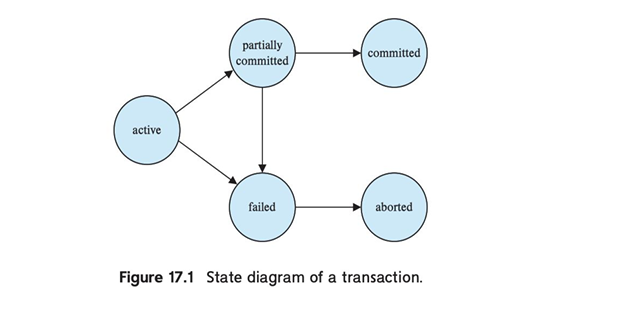
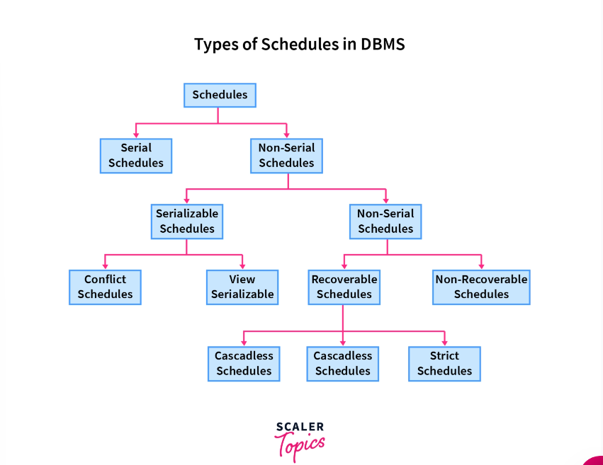
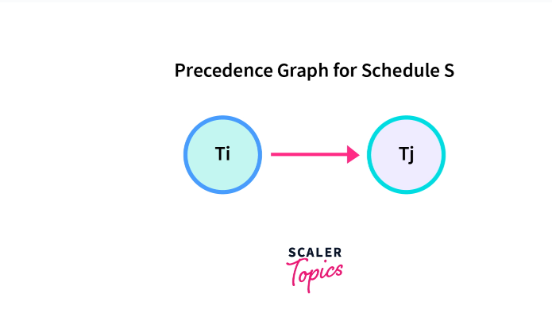
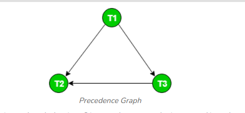
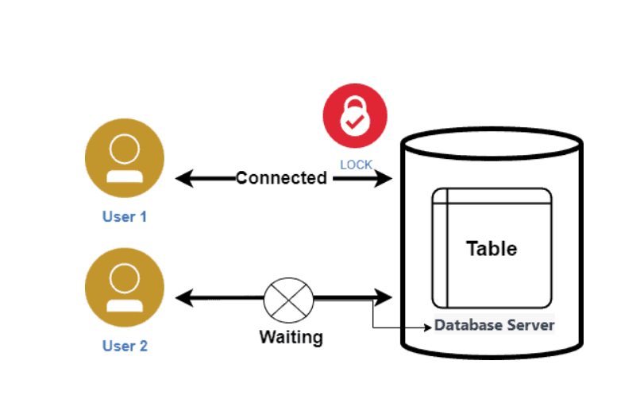
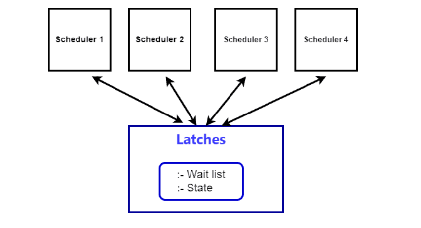
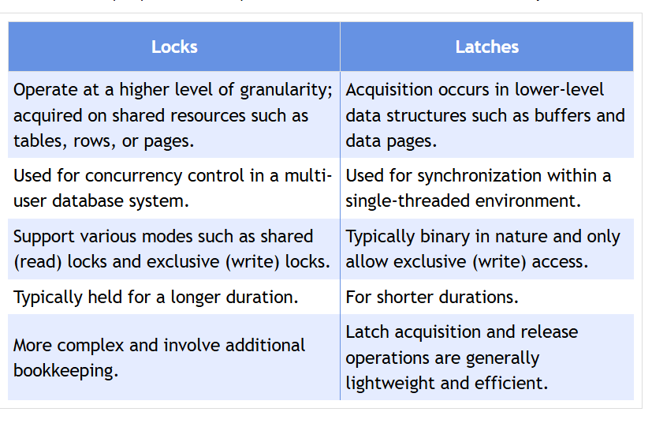
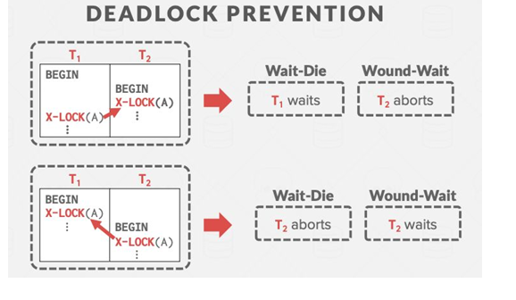
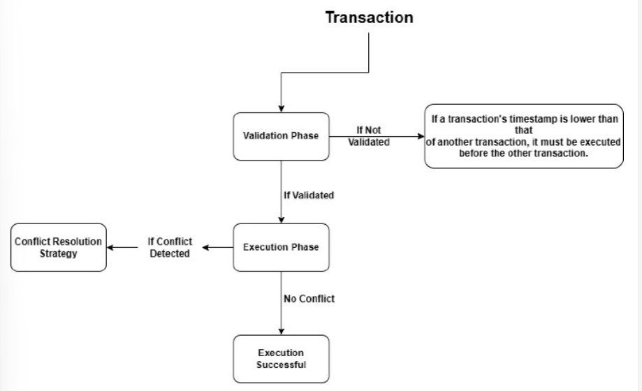

## Unit 7 Tranasction 
- A **transaction** is defined as a collection of operations that form a single logical unit of work, which can access and update various data items in a database   .
- Transactions are initiated with a **begin transaction** statement and concluded with an **end transaction** statement   .

## ACID Properties of Transactions
- **Atomicity**: Ensures that either all operations of a transaction are executed or none are, maintaining database integrity   .
- **Consistency**: Guarantees that a transaction, when executed in isolation, preserves the database's consistency   .
- **Isolation**: Ensures that concurrent transactions do not interfere with each other, appearing as if they are executed serially   .
- **Durability**: After a transaction is successfully completed, its changes persist in the database, even in the event of system failures   .

## Simple Transaction Model

- An example transaction involves transferring $50 from account A to account B, demonstrating the execution of read and write operations   .
- The model illustrates the ACID properties through the consistency of account balances and the handling of failures.

## Storage Structures
- **Volatile Storage**: Fast access but does not survive system crashes (e.g., main memory)   .
- **Non-volatile Storage**: Survives crashes but is slower (e.g., magnetic disks)   .
- **Stable Storage**: Theoretically ensures no data loss through replication   .

## Transaction Atomicity and Durability
- Atomicity requires that if a transaction fails, its effects must be undone, typically managed through logging   .
- Durability necessitates that changes are written to stable storage before transaction completion   .

## Transaction Isolation Levels
- Various isolation levels include:
  - **Serializable**: Ensures transactions are executed in a serial order   .
  - **Repeatable Read**: Only committed data can be read   .
  - **Read Committed**: Allows reading only committed data, permitting non-repeatable reads   .
  - **Read Uncommitted**: Permits reading uncommitted data   .

## what is serializability?
It helps in maintaining the transactions to execute simultaneously without interleaving one another. In simple words, serializability is a way to check if the execution of two or more transactions are maintaining the database consistency or not.

## Schedules and Serializable Schedules in DBMS

## Testing of Serializability

To test the serializability of a schedule, we can use Serialization Graph or Precedence Graph. A serialization Graph is nothing but a Directed Graph of the entire transactions of a schedule.

It can be defined as a Graph G(V, E) consisting of a set of directed-edges E = {E1, E2, E3, ..., En} and a set of vertices V = {V1, V2, V3, ...,Vn}. The set of edges contains one of the two operations - READ, WRITE performed by a certain transaction.
## Ensuring Serializability
- **Conflict Serializability**: A schedule is conflict serializable if it can be transformed into a serial schedule   .
- **Precedence Graph**: A directed graph used to test conflict serializability by representing transactions and their interactions   .

**Creating Precedence Graph**
Step 1: Make two nodes corresponding to Transaction T1 and T2.

Step 2: For the conflicting pair r1(x) w2(x), where r1(x) happens before w2(x), draw an edge from T1 to T2.

Step 3: For the conflicting pair w2(x) w1(x), where w2(x) happens before w1(x), draw an edge from T2 to T1.

In Topological Sort, we first select the node with in-degree 0, which is T1. This would be followed by T3 and T2. So, S1 is conflict serializable since it is conflict equivalent to the serial schedule T1 T3 T2.

### Advantages of Precedence Graphs for Testing Conflict Serializability

- **Simple to comprehend**: Shows transaction relationships visually, making it easy to understand.
- **Quick analysis**: Helps rapidly determine if a schedule is conflict serializable.
- **Finding anomalies**: Can detect cycles or deadlocks that may not be immediately obvious.
- **Assists with optimization**: Identifies parallelizable transactions to improve performance.

### Disadvantages of Precedence Graphs for Testing Conflict Serializability

- **Complex for large systems**: Difficult to discern dependencies in large-scale systems.
- **Potential for inaccurate results**: Some conflicts may go unnoticed.
- **Require manual efforts**: Time-consuming and labor-intensive to construct manually for large systems.
- **Limited applicability**: Only useful for conflict serializability; cannot detect data races or deadlocks.

## Recoverable and Cascadeless Schedules
- **Recoverable Schedules**: Ensure that transactions reading data written by others commit in the correct order   .
- **Cascadeless Schedules**: Require that a transaction must commit before another transaction reads its data   .

## lesson 19 

## Learning Outcomes
- Understand the importance of **locks** in concurrency control.
- Implement locks in database transactions.
- Analyze various concurrency control schemes.

## Concurrency Control
- Concurrency control is essential to maintain the **isolation** property of transactions when executed concurrently.
- Common schemes include **two-phase locking** and **snapshot isolation**.

## Locks

- Locks prevent conflicts by allowing transactions to acquire read or write access to data.
- **Shared locks (S)** allow reading but not writing, while **exclusive locks (X)** permit both reading and writing.
- Transactions must request locks from the concurrency-control manager, which grants them based on compatibility with existing locks.
## Latches 
- A latch is a synchronization mechanism used for concurrent access control and to ensure data consistency. Database management systems (DBMS) commonly utilize latches to actively safeguard shared resources, such as data structures or buffers, from concurrent access by multiple transactions or threads.

## Differences Between Locks and Latches

## Two-Phase Locking
- The two-phase locking protocol consists of a **growing phase** (acquiring locks) and a **shrinking phase** (releasing locks).
- This protocol ensures **serializability** by preventing deadlocks through proper lock management.

## Deadlocks
- A deadlock occurs when transactions wait indefinitely for locks held by each other.
- Deadlock detection involves creating a **waits-for graph** to identify cycles.
- Deadlock handling can involve selecting a **victim transaction** to rollback and break the cycle.

## deadlock detection

## deadlock prevention 

## Lock Granularity
- The granularity of locks can vary from attributes to entire tables, impacting performance and concurrency
## database lock Hierarcy

- **Intention locks** allow higher-level nodes to be locked without checking all descendant nodes.

## How Timestamp Ordering Works?
The timestamp ordering algorithm works by assigning a unique timestamp to each transaction when it arrives in the system. The timestamp reflects the transaction's start time, and it is used to order the transactions for execution. The algorithm consists of two phases: the validation phase and the execution phase.

## Concurrency Control Approaches
- **Pessimistic concurrency control** assumes conflicts will occur and takes preventive measures, such as two-phase locking.
- **Optimistic concurrency control** allows transactions to execute first and checks for conflicts afterward.

## Multi-Version Concurrency Control
- This technique maintains multiple versions of data, allowing readers to access a consistent snapshot without blocking writers.

## Advanced Concurrency Control Techniques
- Techniques like **cursor stability** and **optimistic concurrency control** can enhance concurrency in specific applications.
- In **real-time databases**, transactions with deadlines are prioritized to ensure timely execution.

## lesson 20
## Learning Outcomes
- Understand **recovery mechanisms** in database systems.
- Analyze **database recovery algorithms**.
- Explain the importance of **database logging** in recovery processes.

## Importance of Recovery Systems
- Recovery systems are crucial due to various potential failures, including:
  - System failures
  - Transaction failures
  - Human errors
  - Security breaches
  - Hardware upgrades
  - Natural disasters
  - Compliance regulations
  - Data corruption
- Transactions must be **atomic**, ensuring that they are completed fully or not at all.

## Log-Based Recovery
- **Log-based recovery** is the most common technique used to ensure atomicity.
- A **log** records all update activities, with each operation logged before modification.
- Log records include:
  - Transaction identifier (Ti)
  - Data item (Xj)
  - Old value (V1)
  - New value (V2)

#

## Database Modification Techniques
- **Deferred-modification**: No changes until the transaction commits.
- **Immediate-modification**: Changes occur while the transaction is active.
- Recovery algorithms must consider:
  - Committed transactions with modifications in memory.
  - Active transactions that may need to abort due to failures.

## Undo and Redo Operations
- **Undo** restores data items to their old values using log records.
- **Redo** applies changes to ensure committed transactions are reflected in the database.
- System crashes dictate whether to undo or redo based on transaction states.

## Checkpoints
- **Checkpoints** periodically record the database state, limiting log examination during recovery.
- During a checkpoint:
  - Log records are written to stable storage.
  - Modified buffer blocks are written to disk.
  - A checkpoint log record is created.

## Fuzzy Checkpoints
- Allow transactions to continue during checkpointing, enhancing system flexibility.
- Introduce complexity in recovery as transactions post-checkpoint must be managed differently.

## Recovery Algorithms
- **ARIES** (Algorithms for Recovery and Isolation Exploiting Semantics) is a key recovery algorithm that operates in three passes: analysis, redo, and undo.
- **Write-Ahead Logging (WAL)** ensures changes are logged before database updates.

## Recovery in Main-Memory Databases
- Main-memory databases require persistent storage for recovery due to volatility.
- Optimizations include avoiding redo logging for index updates and parallel recovery across CPU cores to minimize downtime.

